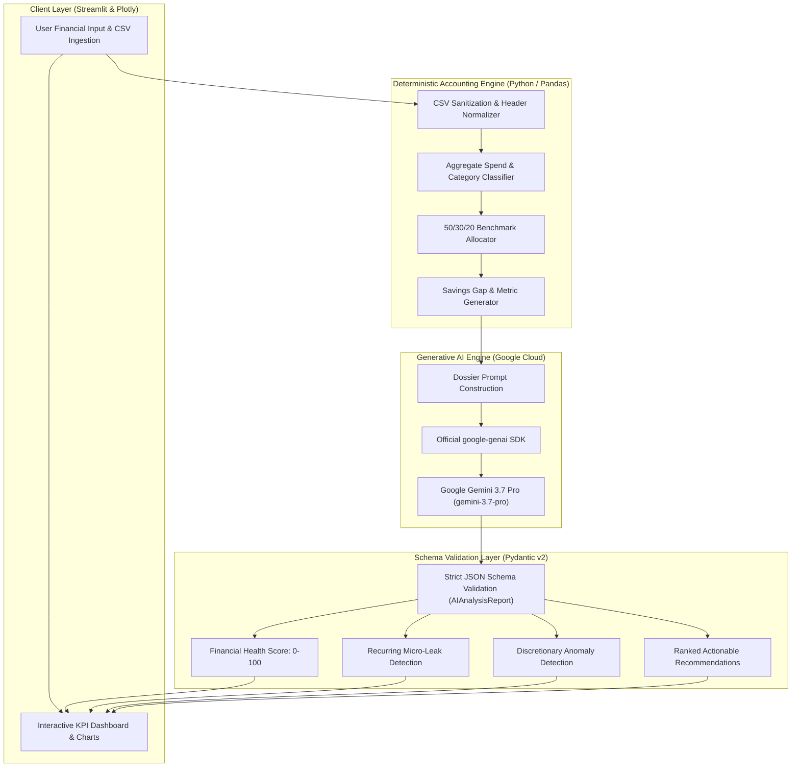

<div align="center">

# 💳 PocketSmart AI
### *Your Intelligent Dual-Engine Budget & Financial Recommendation Assistant*

[](https://www.python.org/)
[](https://aistudio.google.com/)
[](https://streamlit.io/)
[](https://docs.pydantic.dev/)
[](https://www.docker.com/)
[](https://cloud.google.com/run)

<p align="center">
  <b>A production-ready FinTech system combining deterministic cash-flow arithmetic with Google Gemini 3.7 Pro reasoning via the official <code>google-genai</code> Python SDK.</b>
</p>

[Explore Features](#-key-features) •
[Architecture](#-system-architecture) •
[Quickstart](#-quickstart-guide) •
[Structured JSON Output](#-structured-ai-schema) •
[Roadmap](#-future-roadmap)

---

</div>

## 📌 Problem & Architectural Innovation

Traditional personal finance tools suffer from a fundamental trade-off:
- **Static Spreadsheet Trackers**: Display historical numbers but cannot diagnose *why* users miss savings goals or *how* to change behavioral spending patterns.
- **Pure-LLM Financial Chatbots**: Hallucinate basic arithmetic (sums, percentages, budget balances) and fail to adhere to deterministic accounting rules.

**PocketSmart AI** solves this through a **Hybrid Deterministic-Probabilistic Architecture**:
1. **Deterministic Core Engine**: All ledger computations, savings gap calculations, and 50/30/20 benchmark allocations are executed in pure Python with mathematical precision (0% hallucination risk).
2. **Generative AI Advisory Engine**: Google's **Gemini 3.7 Pro** analyzes the verified financial dossier using strict Pydantic JSON schema validation, extracting micro-spend leaks, identifying anomalies, and generating prioritized, dollar-quantified action plans.

---

## 🏗️ System Architecture



---

## ✨ Key Features

| Feature | Description | Engine / Stack |
| :--- | :--- | :--- |
| **Dynamic Ingestion** | Supports manual itemized expenses and bulk CSV transaction statements with automated header mapping. | `Pandas`, `budget_engine.py` |
| **50/30/20 Analytics** | Benchmarks spending against standard 50% Needs, 30% Wants, and 20% Savings rules. | Deterministic Python Engine |
| **Interactive Visuals** | Real-time Plotly Donut Charts and Grouped Bar Comparisons styled in a modern dark FinTech theme. | `Plotly`, `Streamlit` |
| **Micro-Leak Detection** | Automatically detects recurring micro-drains (coffee runs, in-app purchases, unused subscriptions) with estimated monthly waste. | `Gemini 3.7 Pro`, `google-genai` |
| **Spending Anomalies** | Highlights irregular purchases disproportionate to net income with contextual rationales. | `Gemini 3.7 Pro` |
| **Prioritized Action Plans**| Generates ranked advice (1–5) with concrete steps, difficulty ratings, and estimated dollar savings. | Pydantic `AIAnalysisReport` |
| **Dual Testing Suite** | Includes mock dry-runs for CI/CD and live API verification with 100% test coverage. | `test_pipeline.py`, `pytest` |

---

## 💻 Quickstart Guide

### 1. Clone & Set Up Environment
```powershell
# Clone the repository
git clone https://github.com/YOUR_GITHUB_USERNAME/pocketsmart-ai.git
cd pocketsmart-ai

# Create and activate virtual environment
python -m venv venv
.\venv\Scripts\Activate.ps1   # On Windows
# source venv/bin/activate    # On Linux/macOS
```

### 2. Install Dependencies
```bash
pip install -r requirements.txt
```

### 3. Configure API Credentials
```powershell
Copy-Item .env.example .env
```
Edit `.env`:
```env
GEMINI_API_KEY=AIzaSyYourGeminiApiKeyHere
```
*(Alternatively, enter your key directly in the web UI sidebar).*

### 4. Run Locally
```bash
streamlit run app.py
```
Open **`http://localhost:8501`** in your browser.

### 5. Run Automated Tests
```powershell
# Fast, offline dry-run (zero API cost):
python test_pipeline.py --mode mock

# Live Gemini 3.7 Pro end-to-end test:
python test_pipeline.py --mode live
```

---

## 📋 Structured AI Schema Output

PocketSmart AI enforces strict type safety using Pydantic. Gemini 3.7 Pro outputs structured responses conforming to:

```json
{
  "overall_health_score": 78,
  "health_summary": "Strong core cash-flow surplus with elevated discretionary spending across dining and subscription tiers.",
  "savings_feasibility": "High. Closing the $200 monthly gap is achievable by trimming micro-spend leakage.",
  "budget_leaks": [
    {
      "category": "Food & Dining",
      "description": "High-frequency weekday artisanal coffee and snack purchases.",
      "estimated_monthly_waste": 145.50,
      "severity": "Medium"
    }
  ],
  "spending_anomalies": [
    {
      "item": "Luxury Designer Watch",
      "amount": 3200.00,
      "reason": "Single discretionary purchase consuming 64% of total monthly income."
    }
  ],
  "recommendations": [
    {
      "priority": 1,
      "title": "Consolidate Digital Subscriptions",
      "action_plan": "Audit streaming platforms and eliminate redundant tiers to instantly reclaim cash.",
      "potential_monthly_savings": 45.00,
      "difficulty": "Easy"
    }
  ]
}
```

---

## 🚀 Cloud Deployment

### Google Cloud Run (Containerized)
```powershell
# Build and deploy via Google Cloud CLI
gcloud builds submit --tag gcr.io/YOUR_PROJECT_ID/pocketsmart-ai:v1.0.0 .

gcloud run deploy pocketsmart-ai \
    --image gcr.io/YOUR_PROJECT_ID/pocketsmart-ai:v1.0.0 \
    --platform managed \
    --region us-central1 \
    --allow-unauthenticated \
    --set-env-vars GEMINI_API_KEY="your_api_key" \
    --port 8080
```

### Streamlit Community Cloud
1. Link your GitHub repository to [share.streamlit.io](https://share.streamlit.io/).
2. In **Secrets**, configure `GEMINI_API_KEY = "AIzaSy..."`.
3. Deploy!

---

---

## 📁 Repository Structure

```
├── backend/
│   ├── main.py                     # FastAPI core engine & REST endpoints
│   ├── schemas.py                  # Pydantic v2 schemas & request validation
│   ├── schemas_v2.py               # Multimodal & extended data contracts
│   └── services/
│       ├── auth_service.py         # Session security & token handling
│       ├── planner_service.py      # 8 real-world budget optimizers
│       ├── gemini_service.py       # Google GenAI 3.7 Pro engine integration
│       └── budget_engine.py        # Deterministic accounting & math core
│
├── frontend/
│   ├── static/
│   │   ├── css/styles.css          # Executive dark glassmorphic design system
│   │   └── js/app.js               # Client controller & dynamic view router
│   └── templates/
│       └── index.html              # Modern responsive HTML5 application shell
│
├── tests/
│   ├── test_fastapi_endpoints.py   # Full API & optimizer integration tests
│   ├── test_pipeline.py            # Financial calculation verification
│   └── test_production_integration.py # End-to-end stress & mock verification
│
├── docs/                           # Architecture, portfolio, & deployment dossiers
├── data/                           # Sample transaction datasets for testing
├── main.py                         # Root entry point launcher
└── requirements.txt                # Python runtime dependencies
```

---

## 🔮 Future Roadmap

- [ ] **Multimodal OCR Statement Ingestion**: Direct PDF/image bank statement scanning via Gemini 3.7 Pro vision capabilities.
- [ ] **Predictive Cash-Flow Forecasting**: Time-series modeling predicting month-end balances based on recurring debit intervals.
- [ ] **Plaid API Banking Integration**: Automated, read-only live transaction syncing from financial institutions.
- [ ] **Personalized Multi-Agent Goal Planner**: Goal-specific autonomous agents for aggressive debt snowball vs. investment optimization.

---

## 📄 License & Authors

Distributed under the MIT License. Developed as a production-grade Generative AI FinTech demonstration.
